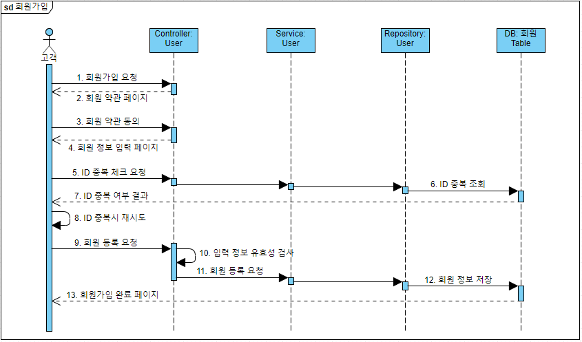
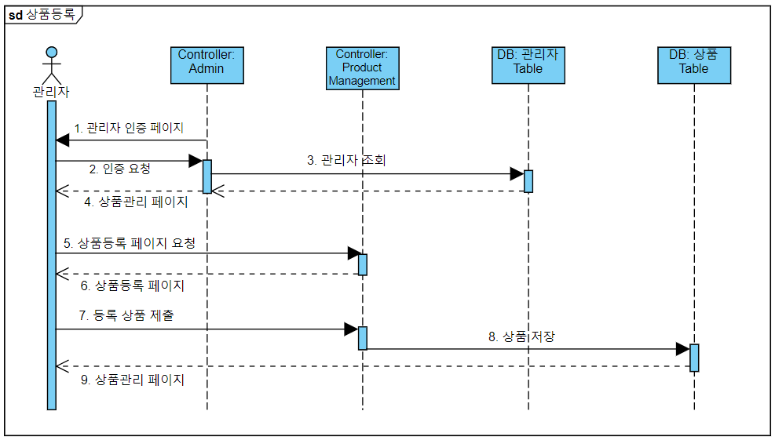

### 시퀀스 다이어그램

#### 1. 사용자

##### 회원가입


```
[회원가입 입력 정책]

1. id,password, name, telephone, email, address, birthday 필수입력
2. id : 공백 없이 영문소문자/숫자, 4~16자
3. password : 공백 없이 영문 대소문자/숫자/특수문자 중 3가지 이상 조합, 8자~16자
4. name : 20글자 이하
5. telephone : XXX - XXXX - XXXX 각각 따로 받아서 조합해줄 예정
6. email : @기준으로 따로 받아서 조합해줄 예정
7. address : 우편번호, 주소1, 주소2 따로 받아서 [우편번호] 주소1 주소2 조합해줄 예정
8. birthday : 연,월,일 따로 받아서 yyyy-mm-dd 조합해줄 예정
```
```
1. 회원 가입 요청
2. 회원 약관 페이지 
3. 회원 약관 동의  - 
4. 회원정보 입력 페이지 
5. 아이디 중복 체크 요청 -  
6. 아이디 중복 조회
7. 아이디 중복 여부 결과
8. 아이디 중복 시 재시도 
9. 회원 등록 요청 -
10. 입력 정보 유효성 검사 
11. 회원 등록 요청
12. 회원 정보 저장 
13. 회원 가입 완료 페이지 반환
	 */
```


#### 2. 관리자

##### 상품등록


```
1. 관리자 인증 요구
2. id,pwd 입력하여 인증 요청
3. 관리자 table 확인
4. 로그인 성공시 관리자 페이지 리다이렉트 
5. 상품 등록 페이지 요청
6. 상품 등록 페이지 
7. 상품을 입력하고 제출
8. 상품 저장 ( 상품, 상품옵션, 옵션,세부옵션)
9. 상품 목록 페이지
10. 상품 수정
11. 상품 삭제
```

#### 3.고객&관리자-상품목록&상품조회


```
1. 상품 리스트 요청 
2. 상품 리스트 조회
3. 상품 리스트 반환
4. 카테고리 선택
5. 상품 리스트 조회
6. 상품 리스트 반환
7. 상품 상세 보기 요청
8. 상품 정보 조회
9. 상품 옵션 정보 조회
10. 상품 상세 정보 반환
```

#### 4. 장바구니 관리

```
1. 장바구니 담기 요청
2. 상품 재고정보요청
3. 상품 재고체크
4. 상품 재고여부반환
5. 옵션 재고체크
6. 옵션 재고여부반환
7. 옵션 선택요구
8. 옵션 선택 
9. 필수업션선택 검증
10. 장바구니추가
11. 장바구니목록
12. 수량변경요청
13. 옵션 재고정보요청
14. 옵션 재고체크
15. 옵션 재고여부반환
16. 옵션 재고정보전달
17. 수량변경
18. 수량변경완료
19. 삭제 요청
20. 삭제
21. 삭제완료

```

#### 5.주문하기


```
1. 주문 요청
2. 재고 정보 요청
3. 재고 조회
4. 재고 여부 반환
5. 재고 정보 반환
6. 사용자 인증 요구
alt ----- 회원일때
7. 회원 정보 입력
8. 회원 조회
9. 로그인 성공 여부 반환
10. 주문서 페이지 이동
------ 비회원일때
11. 비회원 주문 요청
12. 주문서 페이지 이동
---------------------
13. 주문서 작성
14. 필수 입력 정보 검사 
15. (결제완료가정) 재고변경
16. (결제완료가정) 주문서 저장 및 주문상품 저장
17. 장바구니 수량 변경 
18. 주문완료
```


#### 6.주문내역보기


```
1. 주문내역요청
2. 사용자인증요구
alt ----- 회원일때
3. 로그인정보입력
4. 유효성검사
5. 회원조회
6. 로그인여부
7. 로그인 성공
------ 비회원일때
8. 비회원조회정보입력
9. 유효성검사
10. 유효 주문 조회 
----------------
10. 주문내역 요청(회원-NO 기준/ 비회원-이름&주문번호&비회원결제비밀번호로 주문서 찾고 주문서 NO기준)
11. 주문내역 반환 
```
